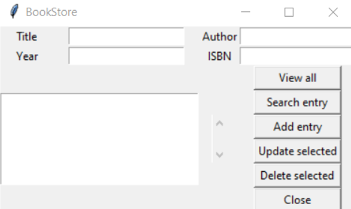
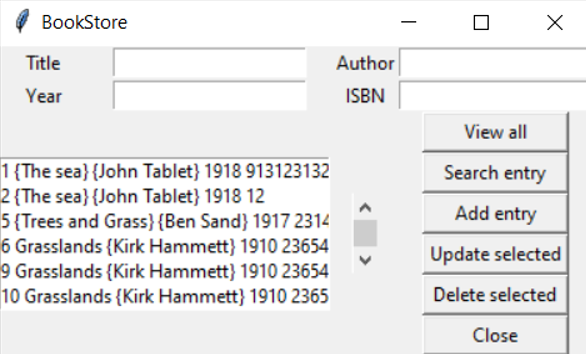
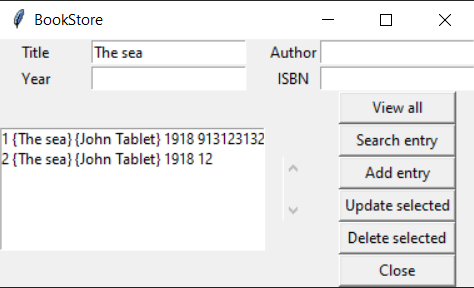
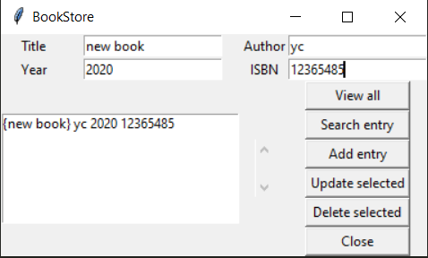
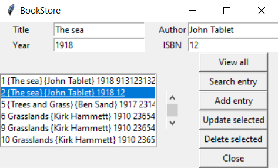
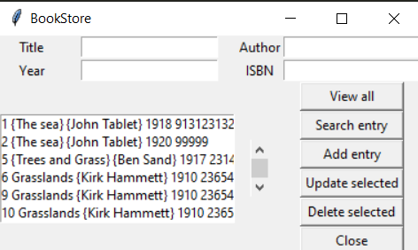
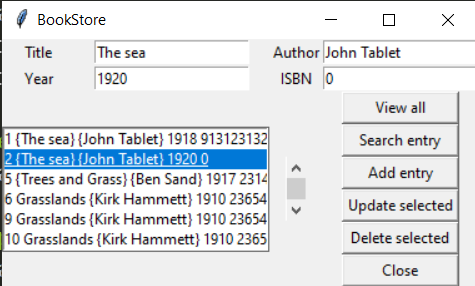
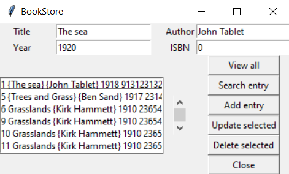

Summary: building a desktop SQL book inventory GUI with python.

Check this blog on [github](#).


**Contents:**
- [1. Introduction](#1-introduction)
- [2. Backend](#2-backend)
- [3. Frontend](#3-frontend)
- [4. Package into .exe file](#4-package-into-exe-file)

## 1. Introduction

Creating a desktop SQL book inventory GUI with python. This app is backed with `sqlite3` database.

**Preview**

**-Interface**
<!--  -->
<p align="center">
  
</p>

**-View all**

<p align="center">
  
</p>

**-Search entry**

<p align="center">
  
</p>

**-Add entry**

<p align="center">
  
</p>

**-Update selected**

<p align="center">
  
  
</p>

**-Delete selected**

<p align="center">
  
  
</p>

## 2. Backend

This app has below functions:
- Creating table
- Inserting data
- Deleting data
- Updating data
- Searching data
- Viewing data

`backend.py`

```python
import sqlite3

def connect():
    conn = sqlite3.connect("books.db")
    cur = conn.cursor()
    cur.execute("CREATE TABLE IF NOT EXISTS book (id INTEGER PRIMARY KEY, title text, author text, year integer, isbn integer)")
    conn.commit()
    conn.close()

def insert(title, author, year, isbn):
    conn = sqlite3.connect("books.db")
    cur = conn.cursor()
    cur.execute("INSERT INTO book VALUES (NULL,?,?,?,?)", (title, author, year, isbn))
    conn.commit()
    conn.close()
    
def view():
    conn = sqlite3.connect("books.db")
    cur = conn.cursor()
    cur.execute("SELECT * FROM book")
    rows = cur.fetchall()
    conn.close()
    return rows

def search(title="", author="", year="", isbn=""):
    conn = sqlite3.connect("books.db")
    cur = conn.cursor()
    cur.execute("SELECT * FROM book WHERE title=? OR author=? OR year=? OR isbn=?", (title, author, year, isbn))
    rows = cur.fetchall()
    conn.close()
    return rows

def delete(id):
    conn = sqlite3.connect("books.db")
    cur = conn.cursor()
    cur.execute("DELETE FROM book WHERE id=?", (id,))
    conn.commit()
    conn.close()
    
def update(id, title, author, year, isbn):
    conn = sqlite3.connect("books.db")
    cur = conn.cursor()
    cur.execute("UPDATE book SET title=?, author=?, year=?, isbn=? WHERE id=?", (title, author, year, isbn, id))
    conn.commit()
    conn.close()
    
connect()    
#insert("The Sun", "John Smith", 1918, 913123132)
#delete(3)
#update(4, "The moon", "John Smooth", 1917, 99999)
#print(view())
#print(search(author="John Smith"))
```

## 3. Frontend

With the help of `tkinter`, the implementation of frontend is very easy.

```python
from tkinter import *
import backend

def get_selected_row(event): #bind to function: '<<ListboxSelect>>'
    try:
        global selected_tuple
        index = list1.curselection()[0] #if not [0], index would be like (0, ) (2, )
        selected_tuple = list1.get(index)
        e1.delete(0, END)
        e1.insert(END, selected_tuple[1])
        e2.delete(0, END)
        e2.insert(END, selected_tuple[2])
        e3.delete(0, END)
        e3.insert(END, selected_tuple[3])
        e4.delete(0, END)
        e4.insert(END, selected_tuple[4])
    except IndexError:
        pass
    
def view_command():
    list1.delete(0, END) #delete contents inside list1 before view all
    for row in backend.view():
        list1.insert(END, row)

def search_command():
    list1.delete(0, END)
    for row in backend.search(title_text.get(), author_text.get(), year_text.get(), isbn_text.get()):
        list1.insert(END, row)

def add_command():
    backend.insert(title_text.get(), author_text.get(), year_text.get(), isbn_text.get()) #add to database
    list1.delete(0, END)
    list1.insert(END, (title_text.get(), author_text.get(), year_text.get(), isbn_text.get())) #show in listbox

def delete_command():
    backend.delete(selected_tuple[0])

def update_command():
    backend.update(selected_tuple[0], title_text.get(), author_text.get(), year_text.get(), isbn_text.get())

window = Tk()
window.wm_title("BookStore")

l1 = Label(window, text="Title")
l1.grid(row=0, column=0)

l2 = Label(window, text="Author")
l2.grid(row=0, column=2)

l3 = Label(window, text="Year")
l3.grid(row=1, column=0)

l4 = Label(window, text="ISBN")
l4.grid(row=1, column=2)

title_text = StringVar()
e1 = Entry(window, textvariable=title_text)
e1.grid(row=0, column=1)

author_text = StringVar()
e2 = Entry(window, textvariable=author_text)
e2.grid(row=0, column=3)

year_text = StringVar()
e3 = Entry(window, textvariable=year_text)
e3.grid(row=1, column=1)

isbn_text = StringVar()
e4 = Entry(window, textvariable=isbn_text)
e4.grid(row=1, column=3)

list1 = Listbox(window, height=6, width=35)
list1.grid(row=2, column=0, rowspan=6, columnspan=2)

sb1 = Scrollbar(window)
sb1.grid(row=2, column=2, rowspan=6)

list1.configure(yscrollcommand=sb1.set) ##############
sb1.configure(command=list1.yview)  ##############

#bind() is used to bind a function to a widget event
list1.bind('<<ListboxSelect>>', get_selected_row)

b1 = Button(window, text="View all", width=12, command=view_command)
b1.grid(row=2, column=3)

b2 = Button(window, text="Search entry", width=12, command=search_command)
b2.grid(row=3, column=3)

b3 = Button(window, text="Add entry", width=12, command=add_command)
b3.grid(row=4, column=3)

b4 = Button(window, text="Update selected", width=12, command=update_command)
b4.grid(row=5, column=3)

b5 = Button(window, text="Delete selected", width=12, command=delete_command)
b5.grid(row=6, column=3)

b6 = Button(window, text="Close", width=12, command=window.destroy)
b6.grid(row=7, column=3)

window.mainloop()
```

## 4. Package into .exe file

- Install `pyinstaller`
- In current folder, run `pyinstaller --onefile --windowed frontend.py`
- In folder `dist`, books.db, frontend.exe are created
