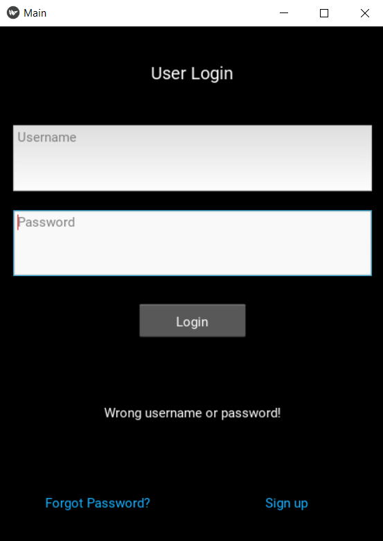
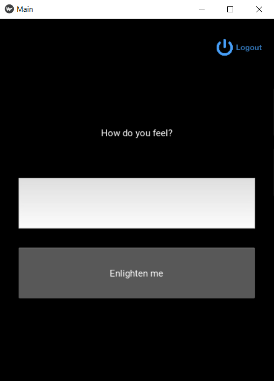
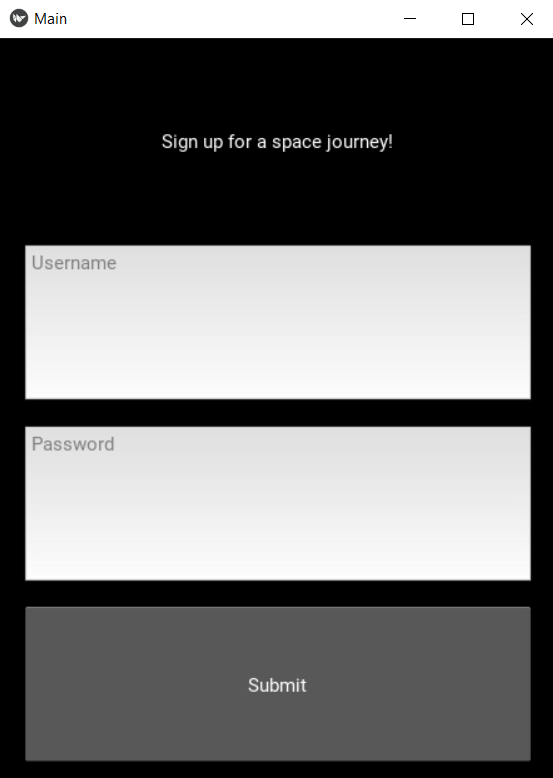
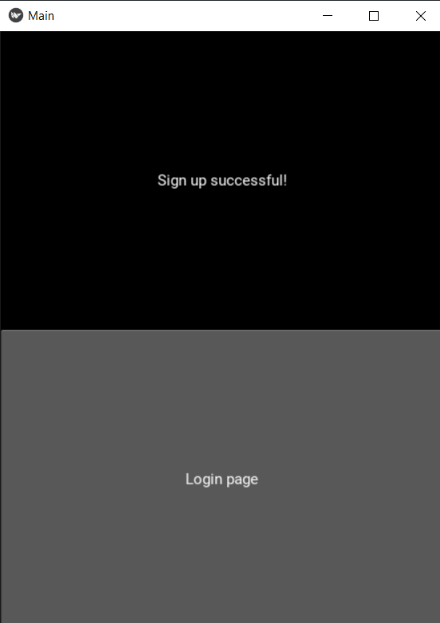
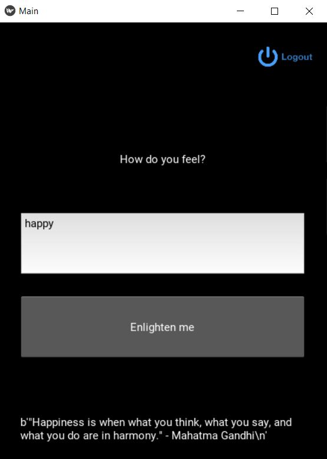

Summary: Build a mobile APP with the library `kivy`.

**Contents:**


## 1. Introduction

Building a mobile Feel-Good APP with python, the library `kivy` was used. 

When login, the user can input mood: `happy, sad, unloved`, press `Enlighten me`, some words will show up.

## 2. Design the front-end

Creating file `design.kv`, there are four screens: 

**-Login screen**

<!--  -->
<p align="center">

</p>

**-Login screen success**

<p align="center">

</p>

**-Sign up screen**

<p align="center">

</p>

**-Sign up screen success**

<p align="center">

</p>


`design.kv`:

```
<LoginScreen>:

    GridLayout:
        cols: 1

        GridLayout:
            cols: 1
            padding: 15, 15
            spacing: 20, 20
            Label: 
                text: "User Login"
                font_size: '20sp' #sp = space-independent pixels
            TextInput:
                id: username
                hint_text: "Username"
            TextInput:
                id: password
                password: True #hidden the password as *****
                hint_text: "Password"
            RelativeLayout:
                Button: 
                    text: "Login"
                    on_press: root.login(root.ids.username.text, root.ids.password.text)
                    size_hint: 0.3, 0.5 #sqeeze 0.3 in horizontal, 0.5 in vertical
                    pos_hint: {'center_x': 0.5, 'center_y': 0.6}
            Label:
                id: login_wrong
                text: ""

        GridLayout:
            cols: 2
            size_hint: 0.2, 0.2
            padding: 10, 10
            spacing: 10, 0
            Button:
                text: "Forgot Password?"
                background_color: 1, 1, 1, 0 #R, G, B, transparency
                opacity: 1 if self.state == 'normal' else 0.5 #when click, opacity is 0.5
                color: 0.1, 0.7, 1, 1
            Button:
                text: "Sign up"
                background_color: 1, 1, 1, 0 #R, G, B, transparency
                opacity: 1 if self.state == 'normal' else 0.5 #when click, opacity is 0.5
                color: 0.1, 0.7, 1, 1
                on_press: root.sign_up()

<SignUpScreen>:
    GridLayout:
        cols: 1
        padding: 20, 20
        spacing: 20, 20
        Label:
            text: "Sign up for a space journey!"
        TextInput: 
            id: username
            hint_text: "Username"
        TextInput:
            id: password
            hint_text: "Password"
        Button:
            text: "Submit"
            on_press: root.add_user(root.ids.username.text, root.ids.password.text)

<SignUpScreenSuccess>:
    GridLayout:
        cols: 1
        Label:
            text: "Sign up successful!"
        Button: 
            text: "Login page"
            on_press: root.go_to_login()

<LoginScreenSuccess>:
    GridLayout:
        cols: 1
        padding: 30, 30
        spacing: 30, 30
        RelativeLayout:
            ImageButton:
                on_press: root.log_out()
                source: 'logout_hover.png' if self.hovered else 'logout_nothover.png'
                size_hint: 0.35, 0.35
                pos_hint: {'center_x': 0.93, 'center_y': 0.8}
        Label:
            text: "How do you feel?"
        TextInput:
            id: feeling
            hint_Text: "Things to try: happy, sad, unloved..."
        Button:
            text: "Enlighten me"
            on_press: root.get_quote(root.ids.feeling.text)
        ScrollView:
            Label:
                id: quote
                text: ""
                text_size: self.width, None
                size_hint_y: None
                height: self.texture_size[1] #texture_size is a tuple: (text.width,text.height)

<RootWidget>:
    LoginScreen:
        name: "login_screen"
    SignUpScreen:
        name: "sign_up_screen"
    SignUpScreenSuccess:
        name: "sign_up_screen_success"
    LoginScreenSuccess:
        name: "login_screen_success"
```

## 3. Back-end

`main.py`

```python
from kivy.app import App
from kivy.lang import Builder
from kivy.uix.screenmanager import ScreenManager, Screen
from kivy.uix.image import Image
from kivy.uix.behaviors import ButtonBehavior
import json, glob, random
from datetime import datetime
from pathlib import Path
from hoverable import HoverBehavior


Builder.load_file('design.kv')

class LoginScreen(Screen):
    def sign_up(self):
        self.manager.current = "sign_up_screen"

    def login(self, uname, pword):
        with open("users.json") as file:
            users = json.load(file)
        if uname in users and users[uname]['password'] == pword:
            self.manager.current  = "login_screen_success"
        else:
            self.ids.login_wrong.text = "Wrong username or password!"


class SignUpScreen(Screen):
    def add_user(self, uname, pword):
        with open("users.json") as file:
            users = json.load(file)

        users[uname] = {'username': uname,
                        'password': pword,
                        'created': datetime.now().strftime("%Y-%m-%d %H-%M-%S")}
        with open("users.json", "w") as file:
            json.dump(users, file)
        self.manager.current = "sign_up_screen_success"

class SignUpScreenSuccess(Screen):
    def go_to_login(self):
        self.manager.transition.direction = 'right' #transition action
        self.manager.current = 'login_screen'

class LoginScreenSuccess(Screen):
    def log_out(self):
        self.manager.transition.direction = "right"
        self.manager.current = "login_screen"

    def get_quote(self, feel):
        feel = feel.lower()
        available_feelings = glob.glob("quotes/*txt")

        #Path(filename).stem will return the filename except the extension
        available_feelings = [Path(filename).stem for filename in available_feelings]

        if feel in available_feelings:
            with open(f"quotes/{feel}.txt", "rb") as file:
                quotes = file.readlines()
            self.ids.quote.text = str(random.choice(quotes))
        else:
            self.ids.quote.text = "Try another feeling"
        
class ImageButton(ButtonBehavior, HoverBehavior, Image):
    pass


class RootWidget(ScreenManager):
    pass

class MainApp(App):
    def build(self):
        return RootWidget()

if __name__ == '__main__':
    MainApp().run()
```

## 4. Result

<p align="center">

</p>


