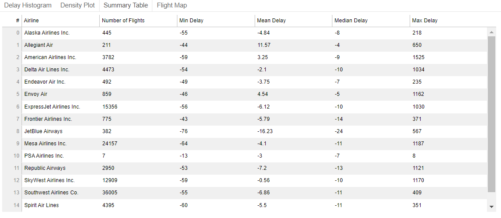

Summary: Create standalone Bokeh dashboard.

This blog is about Bokeh's `CustomJS` method, another blog about `bokeh serve` method can be found [here](https://ycheng22.github.io/Deploy_Bokeh_Server_App_on_Heroku/).

Check this blog on [github](https://github.com/ycheng22/ycheng22.github.io/blob/main/_posts/2021-09-30-2020_Houston_flights_delay_dashboard.md).

**Contents:**
- [1 .Introduction](#1-introduction)
- [2. Data collecting and processing](#2-data-collecting-and-processing)
  - [2.1 Collecting data by `anyflights`](#21-collecting-data-by-anyflights)
  - [2.2 Combining 12 months data](#22-combining-12-months-data)
  - [2.3 Add logitude and latitude to Hou_flights](#23-add-logitude-and-latitude-to-hou_flights)
  - [2.4 Delay time statistics (arrival delay's mean, max, min)](#24-delay-time-statistics-arrival-delays-mean-max-min)
- [3. Creating dashboard step by step](#3-creating-dashboard-step-by-step)
  - [3.1 Histogram of Arrival Delays by Carrier](#31-histogram-of-arrival-delays-by-carrier)
  - [3.2 Density plot](#32-density-plot)
  - [3.3 Flight map](#33-flight-map)
  - [3.4 Table](#34-table)
  - [3.5 Routes](#35-routes)
- [4. Conclusion](#4-conclusion)

## 1 .Introduction

Bokeh is a Python library for creating interactive visualizations for modern web browsers. According to this [blog](https://towardsdatascience.com/data-visualization-with-bokeh-in-python-part-one-getting-started-a11655a467d4), I collected information about all flights depart Houston in 2020 and created similar dashboard.

According to Bokeh's introduction on [widgets](https://docs.bokeh.org/en/latest/docs/user_guide/interaction/widgets.html), there are two ways to use a widget’s functionality:

- A `CustomJS` callback. This approach will work in standalone HTML documents or Bokeh server apps.

- Use `bokeh serve` to start a Bokeh server and set up event handlers with `.on_change` (or for some widgets, `.on_click`).

This blog is about the practice with first method.

Another blog about the second method can be found in this blog: [Deploy Bokeh Server App on Heroku](https://ycheng22.github.io/Deploy_Bokeh_Server_App_on_Heroku/).

Preview:
<p float="left">
  
  
  
  
</p>

## 2. Data collecting and processing

### 2.1 Collecting data by `anyflights`

The [anyflights](https://github.com/simonpcouch/anyflights) package supplies a set of functions to generate air travel data (and data packages!) similar to [nycflights13](https://github.com/hadley/nycflights13). With a user-defined year and airport, the anyflights function will grab data on
- `flights`: all flights that departed a given airport in a given year and month
- `weather`: hourly meterological data for a given airport in a given year and month
- `airports`: airport names, FAA codes, and locations
- `airlines`: translation between two letter carrier (airline) codes and names
- `planes`: construction information about each plane found in flights

It's a `R` package, install the package and download the data in `Rstudio`:

- Download flights data: 
  ```R
  HOUflights20_ <- anyflights(c("IAH", "HOU"), 2020)
  ```
  
  Note: the package has bug now, but it can download all 12 months flights data. 

- Download airports data:  
  ```R
  airports <- get_airports()
  ```

Write them to csv file. 

### 2.2 Combining 12 months data

Note: check details in this [notebook](https://github.com/ycheng22/Trye_Bokeh/blob/main/Bokeh_standalon_JS_demo/data/Data_Processing_part1.ipynb).

```python
import glob
import pandas as pd
from tqdm.notebook import tqdm

select_cols = ['FlightDate', 'Reporting_Airline', 'Origin', 'OriginCityName', 'OriginStateName', 
               'Dest', 'DestCityName', 'DestStateName', 'CRSDepTime', 'DepTime', 'DepDelay', 
               'CRSArrTime', 'ArrTime', 'ArrDelay']

Hou_flights = pd.DataFrame(columns = select_cols)
for name in tqdm(names):
    print(name)
    df = pd.read_csv(name, usecols=select_cols)
    df.dropna(inplace=True)
    df = df[(df['Origin']=='IAH') | (df['Origin']=='HOU')]
    Hou_flights = Hou_flights.append(df)

#add carrier name
carrier_names = pd.read_excel('airlines_code.xlsx')
Hou_flights = Hou_flights.merge(carrier_names, how = 'left', left_on = 'Reporting_Airline', right_on = 'carrier')
Hou_flights.to_csv('Hou_flights.csv', index=False)
```

### 2.3 Add logitude and latitude to Hou_flights

Note: check details in this [notebook](https://github.com/ycheng22/Trye_Bokeh/blob/main/Bokeh_standalon_JS_demo/data/Data_Processing_part2.ipynb).

```python
import glob
import pandas as pd
from tqdm.notebook import tqdm

#Add logitude and latitude to Hou_flights
Hou_flights = pd.read_csv('Hou_flights.csv')
air_columns = ['faa', 'lat', 'lon']
airport_orig = pd.read_csv("airports.csv", usecols = air_columns) #merge for origin location
airport_orig.rename(columns = {'lat': 'orig_lat', 'lon': 'orig_lon'}, inplace=True)
airport_dest = pd.read_csv("airports.csv", usecols = air_columns) #merger for destination location
airport_dest.rename(columns = {'lat': 'dest_lat', 'lon': 'dest_lon'}, inplace=True)

Hou_flights_location = Hou_flights.merge(airport_orig, how = 'left', left_on='Origin', right_on = 'faa')

Hou_flights_location = Hou_flights_location.merge(airport_dest, how = 'left', left_on='Dest', right_on = 'faa')

Hou_flights_location.drop(columns=['faa_x', 'faa_y'], inplace=True)
Hou_flights_location.to_csv('Hou_flights_location.csv', index=False)
```

### 2.4 Delay time statistics (arrival delay's mean, max, min)

Note: check details in this [notebook](https://github.com/ycheng22/Trye_Bokeh/blob/main/Bokeh_standalon_JS_demo/data/Data_Processing_part2.ipynb).

```python
Hou_flights_location = pd.read_csv('Hou_flights_location.csv')

#group by carrier, destination, 
#mean, max, min of arrival delay time, number of flights
df1 = Hou_flights_location.groupby(by=['name', 'Dest', 'Origin'])['ArrDelay'].agg(['mean', 'max', 'min']).reset_index()
counts =  pd.DataFrame(Hou_flights_location.groupby(by=['name', 'Dest', 'Origin']).size().reset_index(name='counts'))

df1 = df1.merge(counts, how='left', on=['name', 'Dest', 'Origin'])
df1.rename(columns={'mean':'ArrDelay_mean', 'max':'ArrDelay_max', 'min':'ArrDelay_min'}, inplace=True)

df2 = Hou_flights_location[['name', 'Origin', 'OriginCityName', 
                         'OriginStateName', 'Dest', 'DestCityName', 'DestStateName','orig_lat',
                         'orig_lon', 'dest_lat', 'dest_lon']]

arr_delay = df1.merge(df2, how='left', on=['name', 'Dest', 'Origin'])

arr_delay.drop_duplicates(inplace=True)

arr_delay.to_csv('arr_delay.csv', index=False)
```

## 3. Creating dashboard step by step

- Check details in this [notebook](https://github.com/ycheng22/Trye_Bokeh/blob/main/Bokeh_standalon_JS_demo/scripts_nb/scripts_nb.ipynb).
- Final [dashboard](https://github.com/ycheng22/Trye_Bokeh/blob/main/Bokeh_standalon_JS_demo/scripts_nb/Hou_flights_delay_plots.html).
  
  *Note:* Download and open the html file in browser to explore the full function. 

### 3.1 Histogram of Arrival Delays by Carrier

```python
#import packages
import pandas as pd
import numpy as np

from bokeh.io import show, output_notebook, output_file
from bokeh.plotting import figure

from bokeh.models import HoverTool, ColumnDataSource, Panel, CustomJS, Column, Row, Select, FuncTickFormatter
from bokeh.models import CheckboxGroup, Slider, RangeSlider, Tabs, TableColumn, DataTable

from bokeh.palettes import Category20_16

# Gaussian kernel density estimate for density plot
from scipy.stats import gaussian_kde

# List of lists to single list
from itertools import chain

output_notebook()
output_file("Hou_flights_delay_plots.html")
```

```python
# Load in flights and inspect
flights = pd.read_csv('../data/Hou_flights.csv', index_col=0)[['ArrDelay', 'Reporting_Airline', 'name']]
# print(flights.head())

# Available carrier list
available_carriers = list(flights['name'].unique())

# Sort the list in-place (alphabetical order)
available_carriers.sort()
print(available_carriers)

def make_dataset(carrier_list, range_start = -100, range_end = 120, bin_width = 5):

    by_carrier = pd.DataFrame(columns=['proportion', 'left', 'right', 
                                       'f_proportion', 'f_interval',
                                       'name', 'color'])
    range_extent = range_end - range_start

    # Iterate through all the carriers
    for i, carrier_name in enumerate(carrier_list):

        # Subset to the carrier
        subset = flights[flights['name'] == carrier_name]

        # Create a histogram with 5 minute bins
        arr_hist, edges = np.histogram(subset['ArrDelay'], 
                                       bins = int(range_extent / bin_width), 
                                       range = [range_start, range_end])

        # Divide the counts by the total to get a proportion
        arr_df = pd.DataFrame({'proportion': arr_hist / np.sum(arr_hist), 'left': edges[:-1], 'right': edges[1:] })

        # Format the proportion 
        arr_df['f_proportion'] = ['%0.5f' % proportion for proportion in arr_df['proportion']]

        # Format the interval
        arr_df['f_interval'] = ['%d to %d minutes' % (left, right) for left, right in zip(arr_df['left'], arr_df['right'])]

        # Assign the carrier for labels
        arr_df['name'] = carrier_name

        # Color each carrier differently
        arr_df['color'] = Category20_16[i]

        # Add to the overall dataframe
        by_carrier = by_carrier.append(arr_df)

    # Overall dataframe
    by_carrier = by_carrier.sort_values(['name', 'left'])

    return ColumnDataSource(by_carrier)

def style(p):
    # Title 
    p.title.align = 'center'
    p.title.text_font_size = '20pt'
    p.title.text_font = 'serif'

    # Axis titles
    p.xaxis.axis_label_text_font_size = '14pt'
    p.xaxis.axis_label_text_font_style = 'bold'
    p.yaxis.axis_label_text_font_size = '14pt'
    p.yaxis.axis_label_text_font_style = 'bold'

    # Tick labels
    p.xaxis.major_label_text_font_size = '12pt'
    p.yaxis.major_label_text_font_size = '12pt'

    return p

def make_plot(data):
    # Blank plot with correct labels
    p = figure(plot_width = 700, plot_height = 700, 
              title = 'Histogram of Arrival Delays by Carrier',
              x_axis_label = 'Delay (min)', y_axis_label = 'Proportion')

    # Quad glyphs to create a histogram
    p.quad(source = data, bottom = 0, top = 'proportion', left = 'left', right = 'right',
           color = 'color', fill_alpha = 0.7, hover_fill_color = 'color', legend_field = 'name',
           hover_fill_alpha = 1.0, line_color = 'black')

    # Hover tool with vline mode
    hover = HoverTool(tooltips=[('Carrier', '@name'), 
                                ('Delay', '@f_interval'),
                                ('Proportion', '@f_proportion')],
                      mode='vline')

    p.add_tools(hover)

    # Styling
    p = style(p)

    return p

carrier_list=available_carriers
data = make_dataset(carrier_list, range_start = -100, range_end = 120, bin_width = 5)

#add range slider

source = ColumnDataSource(dict(proportion = [], left = [], right = [], color=[], name=[], f_proportion=[], f_interval=[]))

callback = CustomJS(args = {'source': source, 'data_source': data},
    code = """
        var data = data_source.data;
        var s_data = source.data;

        var select_vals = cb_obj.active.map(x => cb_obj.labels[x]);
        console.log(select_vals);
        //read original data

        var proportion_data = data['proportion'];
        var left_data = data['left'];
        var right_data = data['right'];
        var color_data = data['color'];
        var name_data = data['name'];
        var f_proportion_data = data['f_proportion'];
        var f_interval_data = data['f_interval'];


        //initialize source data
        var proportion = s_data['proportion'];
        proportion.length = 0;
        var left = s_data['left'];
        left.length = 0;
        var right = s_data['right'];
        right.length = 0;
        var color = s_data['color'];
        color.length = 0;
        var name = s_data['name'];
        name.length = 0;
        var f_proportion = s_data['f_proportion'];
        f_proportion.length = 0;
        var f_interval = s_data['f_interval'];
        f_interval.length = 0;

        for (var i = 0; i < proportion_data.length; i++) {
            if (select_vals.indexOf(name_data[i]) >= 0) {
                proportion.push(proportion_data[i]);
                left.push(left_data[i]);
                right.push(right_data[i]);
                color.push(color_data[i]);
                name.push(name_data[i]);
                f_proportion.push(f_proportion_data[i]);
                f_interval.push(f_interval_data[i]);
                }
        }
        source.change.emit();
        console.log("callback completed");
    """)

p = make_plot(source)

chkbxgrp = CheckboxGroup(labels = available_carriers, active=[])
chkbxgrp.js_on_change('active', callback)

range_slider = RangeSlider(start = -100, end = 180, value = (-100, 120), step = 5, title = 'Delay Range (min)')
range_slider.js_on_change('value',
    CustomJS(args=dict(other=p.x_range),
             code="""
             other.start = this.value[0];
             other.end = this.value[1];
             """)
)

layout = Row(Column(chkbxgrp, range_slider), p)

tab_hist = Panel(child=layout, title = 'Delay Histogram')
tabs = Tabs(tabs=[tab_hist])
    
show(tabs)
```


fig 1: Histogram of Arrival Delays by Carrier

### 3.2 Density plot

```python
# Load in flights and inspect
flights = pd.read_csv('../data/Hou_flights.csv', index_col=0)[['ArrDelay', 'Reporting_Airline', 'name']]
# print(flights.head())

# Available carrier list
available_carriers = list(flights['name'].unique())

# Sort the list in-place (alphabetical order)
available_carriers.sort()

print(available_carriers)
airline_colors = Category20_16

def make_kde_dataset(carrier_list, range_start = -100, range_end = 120, bandwidth = 5):

    xs = []
    ys = []
    colors = []
    labels = []
    names = []

    for i, carrier in enumerate(carrier_list):
        subset = flights[flights['name'] == carrier]
        subset = subset[subset['ArrDelay'].between(range_start, range_end)]

        kde = gaussian_kde(subset['ArrDelay'], bw_method=bandwidth)
        # Evenly space x values
        x = np.linspace(range_start, range_end, 100)
        # Evaluate pdf at every value of x
        y = kde.pdf(x)

        # Append the values to plot
        xs.append(list(x))
        ys.append(list(y))
        
#         #store name for checkbox
#         names.append(carrier)

        # Append the colors and label
        colors.append(airline_colors[i])
        labels.append(carrier)

    kernel_source = ColumnDataSource(data={'x': xs, 'y': ys, 'color': colors, 'label': labels})

    return kernel_source

carrier_list = available_carriers
kde_data = make_kde_dataset(carrier_list)

def style(p):
    # Title 
    p.title.align = 'center'
    p.title.text_font_size = '20pt'
    p.title.text_font = 'serif'

    # Axis titles
    p.xaxis.axis_label_text_font_size = '14pt'
    p.xaxis.axis_label_text_font_style = 'bold'
    p.yaxis.axis_label_text_font_size = '14pt'
    p.yaxis.axis_label_text_font_style = 'bold'

    # Tick labels
    p.xaxis.major_label_text_font_size = '12pt'
    p.yaxis.major_label_text_font_size = '12pt'

    return p

def make_kde_plot(kde_src):
    p = figure(plot_width = 700, plot_height = 700,
               title = 'Density Plot of Arrival Delays by Airline',
               x_axis_label = 'Delay (min)', y_axis_label = 'Density')


    p.multi_line('x', 'y', color = 'color', legend_field = 'label', 
                 line_width = 3,
                 source = kde_src)

    # Hover tool with next line policy
    hover = HoverTool(tooltips=[('Carrier', '@label'), 
                                ('Delay', '$x'),
                                ('Density', '$y')],
                      line_policy = 'next')

    # Add the hover tool and styling
    p.add_tools(hover)

    p = style(p)

    return p

#add range slider

source = ColumnDataSource(dict(x = [], y = [], color = [], label=[]))

callback = CustomJS(args = {'source': source, 'data_source': kde_data},
    code = """
        var data = data_source.data;
        var s_data = source.data;

        var select_vals = cb_obj.active.map(x => cb_obj.labels[x]);
        console.log(select_vals);
        
        //read original data
        var x_data = data['x'];
        var y_data = data['y'];
        var label_data = data['label'];
        var color_data = data['color'];

        //initialize source data
        var x = s_data['x'];
        x.length = 0;
        var y = s_data['y'];
        y.length = 0;
        var label = s_data['label'];
        label.length = 0;
        var color = s_data['color'];
        color.length = 0;

        for (var i = 0; i < x_data.length; i++) {
            if (select_vals.indexOf(label_data[i]) >= 0) {
                x.push(x_data[i]);
                y.push(y_data[i]);
                label.push(label_data[i]);
                color.push(color_data[i]);
                }
        }
        source.change.emit();
        console.log("callback completed");
    """)

p = make_kde_plot(source)

chkbxgrp = CheckboxGroup(labels = available_carriers, active=[])
chkbxgrp.js_on_change('active', callback)

range_slider = RangeSlider(start = -100, end = 180, value = (-100, 120), step = 5, title = 'Delay Range (min)')
range_slider.js_on_change('value',
    CustomJS(args=dict(other=p.x_range),
             code="""
             other.start = this.value[0];
             other.end = this.value[1];
             """)
)

layout = Row(Column(chkbxgrp, range_slider), p)

tab_density = Panel(child=layout, title = 'Density Plot')
tabs = Tabs(tabs=[tab_hist, tab_density])
    
show(tabs)
```


fig 2: Density Plot of Arrival Delays by airline

### 3.3 Flight map

```python
# Included data in Bokeh for map
from bokeh.sampledata.us_states import data as states

# Remove Alaska and Hawaii
if 'HI' in states: del states['HI']
if 'AK' in states: del states['AK']
    
# Put longitudes and latitudes in lists
xs = [states[state]['lons'] for state in states]
ys = [states[state]['lats'] for state in states]

# Formatted Flight Delay Data for map
map_data = pd.read_csv('../data/arr_delay.csv')
map_data.head()

print(f"map_data shape before drop Alaska and Hawaii: {map_data.shape}")
# map_data = map_data[(map_data.DestStateName != 'Alaska') & (map_data.DestStateName != 'Hawaii')]
map_data = map_data[(map_data['DestStateName']!='Alaska') & (map_data['DestStateName']!='Hawaii')]
print(f"map_data shape after drop: {map_data.shape}")

# Available carrier list
available_carriers = list(map_data['name'].unique())

# Sort the list in-place (alphabetical order)
available_carriers.sort()
print(available_carriers)

# Function to make a dataset for the map based on a list of carriers
def make_dataset(carrier_list):

    # Subset to the carriers in the specified list
    subset = map_data[map_data['name'].isin(carrier_list)]


    # Dictionary mapping carriers to colors
    color_dict = {carrier: color for carrier, color in zip(list(set(map_data['name'])), 
                                                           Category20_16)}

    # Lists of data for plotting
    flight_x = []
    flight_y = []
    colors = []
    carriers = []
    counts = []
    mean_delays = []
    min_delays = []
    max_delays = []
    dest_loc = []
    origin_x_loc = []
    origin_y_loc = []
    dest_x_loc = []
    dest_y_loc = []
    origins = []
    dests = []
    origin_citys = []
    dest_citys = []

    # Iterate through each carrier
    for carrier in carrier_list:

        # Subset to the carrier
        sub_carrier = subset[subset['name'] == carrier]

        # Iterate through each route (origin to destination) for the carrier
        for _, row in sub_carrier.iterrows():

            colors.append(color_dict[carrier])
            carriers.append(carrier)
            origins.append(row['Origin'])
            dests.append(row['Dest'])
            origin_citys.append(row['OriginCityName'])
            dest_citys.append(row['DestCityName'])
            

            # Origin x (longitude) and y (latitude) location
            origin_x_loc.append(row['orig_lon'])
            origin_y_loc.append(row['orig_lat'])

            # Destination x (longitude) and y latitude (location)
            dest_x_loc.append(row['dest_lon'])
            dest_y_loc.append(row['dest_lat'])

            # Flight x (longitude) locations
            flight_x.append([row['orig_lon'], 
                             row['dest_lon']])

            # Flight y (latitude) locations
            flight_y.append([row['orig_lat'], 
                             row['dest_lat']])


            # Stats about the particular route
            counts.append(row['counts'])
            mean_delays.append(row['ArrDelay_mean'])
            min_delays.append(row['ArrDelay_min'])
            max_delays.append(row['ArrDelay_max'])


    # Create a column data source from the lists of lists
    new_map_src = ColumnDataSource(data = {'carrier': carriers, 'flight_x': flight_x, 'flight_y': flight_y, 
                                           'origin_x_loc': origin_x_loc, 'origin_y_loc': origin_y_loc,
                                           'dest_x_loc': dest_x_loc, 'dest_y_loc': dest_y_loc,
                                           'color': colors, 'count': counts, 'mean_delay': mean_delays,
                                           'origin': origins, 'dest': dests,
                                           'min_delay': min_delays, 'max_delay': max_delays,
                                          'origin_city':origin_citys, 'dest_city':dest_citys})

    return new_map_src

carrier_list = available_carriers
new_map_data = make_dataset(carrier_list)

# Styling 
def style(p):

    # Title 
    p.title.align = 'center'
    p.title.text_font_size = '20pt'
    p.title.text_font = 'serif'

    # Axis titles
    p.xaxis.axis_label_text_font_size = '14pt'
    p.xaxis.axis_label_text_font_style = 'bold'
    p.yaxis.axis_label_text_font_size = '14pt'
    p.yaxis.axis_label_text_font_style = 'bold'

    # Tick labels
    p.xaxis.major_label_text_font_size = '12pt'
    p.yaxis.major_label_text_font_size = '12pt'

    return p

def make_plot(map_src):

    # Create the plot with no axes or grid
    p = figure(plot_width = 1100, plot_height = 700, title = 'Map of 2020 Flight Delays Departing Houston')
    p.xaxis.visible = False
    p.yaxis.visible = False
    p.grid.visible = False

    # States are drawn as patches
    patches_glyph = p.patches(xs, ys, fill_alpha=0.2, fill_color = 'lightgray', 
                              line_color="#884444", line_width=2, line_alpha=0.8)

    # Airline flights are drawn as lines
    lines_glyph = p.multi_line('flight_x', 'flight_y', color = 'color', line_width = 2, 
                               line_alpha = 0.8, hover_line_alpha = 1.0, hover_line_color = 'color',
                               legend_field = 'carrier', source = map_src)

    # Origins are drawn as squares (all in NYC)
    squares_glyph = p.square('origin_x_loc', 'origin_y_loc', color = 'color', size = 10, source = map_src, 
                             legend_field = 'carrier')

    # Destinations are drawn as circles
    circles_glyph = p.circle('dest_x_loc', 'dest_y_loc', color = 'color', size = 10, source = map_src, 
                             legend_field = 'carrier')

    # Add the glyphs to the plot using the renderers attribute
    p.renderers.append(patches_glyph)
    p.renderers.append(lines_glyph)
    p.renderers.append(squares_glyph)
    p.renderers.append(circles_glyph)

    # Hover tooltip for flight lines, assign only the l
    hover_line = HoverTool(tooltips=[('Airline', '@carrier'),
                                ('Number of Flights', '@count'),
                                ('Average Delay', '@mean_delay{0.0}'),
                                ('Max Delay', '@max_delay{0.0}'),
                                ('Min Delay', '@min_delay{0.0}')],
                          line_policy = 'next',
                          renderers = [lines_glyph])

    # Hover tooltip for origin and destination
    hover_circle = HoverTool(tooltips=[('OriginAirport', '@origin'),
                                       ('OriginCity', '@origin_city'),
                                       ('DestAirport', '@dest'),
                                       ('DestCity', '@dest_city'),
                                       ],
                            renderers = [circles_glyph])

    # Position the location so it does not overlap plot
    p.legend.location = (10, 50)

    # Add the hovertools to the figure
    p.add_tools(hover_line)
    p.add_tools(hover_circle)

    p = style(p) 

    return p

# {'carrier': carriers, 'flight_x': flight_x, 'flight_y': flight_y, 
# 'origin_x_loc': origin_x_loc, 'origin_y_loc': origin_y_loc,
# 'dest_x_loc': dest_x_loc, 'dest_y_loc': dest_y_loc,
# 'color': colors, 'count': counts, 'mean_delay': mean_delays,
# 'origin': origins, 'dest': dests,
# 'min_delay': min_delays, 'max_delay': max_delays,
# 'origin_city':origin_citys, 'dest_city':dest_citys})

source = ColumnDataSource(dict(carrier=[], flight_x=[], flight_y=[], origin_x_loc=[], origin_y_loc=[],
                               dest_x_loc=[], dest_y_loc=[], color=[], count=[], mean_delay=[],
                               origin=[], dest=[], min_delay=[], max_delay=[], origin_city=[],
                               dest_city=[]
                              ))

callback_map = CustomJS(args = {'source': source, 'data_source': new_map_data},
code = """
var data = data_source.data;
var s_data = source.data;

var select_vals = cb_obj.active.map(x => cb_obj.labels[x]);
console.log(select_vals);
//read original data
var carrier_data = data['carrier'];
var flight_x_data = data['flight_x'];
var flight_y_data = data['flight_y'];
var origin_x_loc_data = data['origin_x_loc'];
var origin_y_loc_data = data['origin_y_loc'];
var dest_x_loc_data = data['dest_x_loc'];
var dest_y_loc_data = data['dest_y_loc'];
var color_data = data['color'];
var count_data = data['count'];
var mean_delay_data = data['mean_delay'];
var origin_data = data['origin'];
var dest_data = data['dest'];
var min_delay_data = data['min_delay'];
var max_delay_data = data['max_delay'];
var origin_city_data = data['origin_city'];
var dest_city_data = data['dest_city'];

//initialize source data
var carrier = s_data['carrier'];
carrier.length = 0;
var flight_x = s_data['flight_x'];
flight_x.length = 0;
var flight_y = s_data['flight_y'];
flight_y.length = 0;
var origin_x_loc = s_data['origin_x_loc'];
origin_x_loc.length = 0;
var origin_y_loc = s_data['origin_y_loc'];
origin_y_loc.length = 0;
var dest_x_loc = s_data['dest_x_loc'];
dest_x_loc.length = 0;
var dest_y_loc = s_data['dest_y_loc'];
dest_y_loc.length = 0;
var color = s_data['color'];
color.length = 0;
var count = s_data['count'];
count.length = 0;
var mean_delay = s_data['mean_delay'];
mean_delay.length = 0;
var origin = s_data['origin'];
origin.length = 0;
var dest = s_data['dest'];
dest.length = 0;
var min_delay = s_data['min_delay'];
min_delay.length = 0;
var max_delay = s_data['max_delay'];
max_delay.length = 0;
var origin_city = s_data['origin_city'];
origin_city.length = 0;
var dest_city = s_data['dest_city'];
dest_city.length = 0;

for (var i = 0; i < carrier_data.length; i++) {
    if (select_vals.indexOf(carrier_data[i]) >= 0) {
        carrier.push(carrier_data[i]);
        flight_x.push(flight_x_data[i]);
        flight_y.push(flight_y_data[i]);
        origin_x_loc.push(origin_x_loc_data[i]);
        origin_y_loc.push(origin_y_loc_data[i]);
        dest_x_loc.push(dest_x_loc_data[i]);
        dest_y_loc.push(dest_y_loc_data[i]);
        color.push(color_data[i]);
        count.push(count_data[i]);
        mean_delay.push(mean_delay_data[i]);
        origin.push(origin_data[i]);
        dest.push(dest_data[i]);
        min_delay.push(min_delay_data[i]);
        max_delay.push(max_delay_data[i]);
        origin_city.push(origin_city_data[i]);
        dest_city.push(dest_city_data[i]);
        }
}
source.change.emit();
console.log("callback completed");
""")
p = make_plot(source)
chkbxgrp = CheckboxGroup(labels = available_carriers, active=[])
chkbxgrp.js_on_change('active', callback_map)
layout = Row(chkbxgrp, p)

tab_map = Panel(child=layout, title = 'Flight Map')
tabs = Tabs(tabs=[tab_hist, tab_density, tab_map])
    
show(tabs)
```


fig 3: Flight map

### 3.4 Table

```python
# Load in flights and inspect
flights = pd.read_csv('../data/Hou_flights.csv', index_col=0)[['ArrDelay', 'Reporting_Airline', 'name']]
print(flights.head())

carrier_stats = flights.groupby('name')['ArrDelay'].describe()

carrier_stats = flights.groupby('name')['ArrDelay'].describe()
carrier_stats = carrier_stats.reset_index().rename(columns={'name': 'airline', 
                                                            'count': 'flights', 
                                                            '50%':'median'})
carrier_stats['mean'] = carrier_stats['mean'].round(2)

carrier_src = ColumnDataSource(carrier_stats)

table_columns = [TableColumn(field='airline', title='Airline'),
                 TableColumn(field='flights', title='Number of Flights'),
                 TableColumn(field='min', title='Min Delay'),
                 TableColumn(field='mean', title='Mean Delay'),
                 TableColumn(field='median', title='Median Delay'),
                 TableColumn(field='max', title='Max Delay')]

carrier_table = DataTable(source=carrier_src, columns=table_columns, width=1000)

tab_table = Panel(child = carrier_table, title = 'Summary Table')
tabs = Tabs(tabs=[tab_hist, tab_density, tab_table, tab_map])
show(tabs)
```


fig 4: Table of arrival delay statistics by airline

### 3.5 Routes

```python
# Load in flights and inspect
flights = pd.read_csv('../data/Hou_flights.csv', index_col=0)[['Origin', 'Dest', 'ArrDelay', 'name']]
print(flights.head())

def make_dataset(origin, destination):
    # Subset to the selected route
    subset = flights[(flights['Dest'] == destination) & (flights['Origin'] == origin)]

    # Find the carriers who cover particular route
    carriers = list(set(subset['name']))

    # x is the delay, y is the airline
    xs = []
    ys = []
    label_dict = {}

    # Iterate through the unique carriers
    for i, carrier in enumerate(carriers):

        # Subset to the carrier
        carrier_data = flights[flights['name'] == carrier]

        # Append the index of the carrier as many times as there are flights
        # Append the delays for the carrier
        ys.append([i for _ in range(len(carrier_data))])
        xs.append(list(carrier_data['ArrDelay']))

        # Map the index to the carrier
        label_dict[i]= carrier

    xs = list(chain(*xs))
    ys = list(chain(*ys))

    new_plan_src = ColumnDataSource(data = {'x': xs, 'y': ys})

    return new_plan_src, label_dict

def style(p):
    # Title 
    p.title.align = 'center'
    p.title.text_font_size = '20pt'
    p.title.text_font = 'serif'

    # Axis titles
    p.xaxis.axis_label_text_font_size = '14pt'
    p.xaxis.axis_label_text_font_style = 'bold'
    p.yaxis.axis_label_text_font_size = '14pt'
    p.yaxis.axis_label_text_font_style = 'bold'

    # Tick labels
    p.xaxis.major_label_text_font_size = '12pt'
    p.yaxis.major_label_text_font_size = '12pt'

    return p

def make_plot(src, origin, destination, label_dict):

    p = figure(plot_width = 600, plot_height = 200, x_axis_label = 'Delay (min)',
            y_axis_label = '',
            title = 'Arrival Delays for Flights from %s to %s' % (origin, destination))

    p.circle('x', 'y', source = src, alpha = 0.4,
             color = 'navy', size = 15)
    p.yaxis[0].ticker.desired_num_ticks = len(label_dict)

    p.yaxis.formatter = FuncTickFormatter(code = """
                        var labels = %s;
                        return labels[tick];
                        """ % label_dict)
    p = style(p)
    return p

origins = list(set(flights['Origin']))
dests = list(set(flights['Dest']))

origin_select = Select(title = 'Origin', value = 'IAH', options = origins)

dest_select = Select(title = 'Destination', value = 'JFK', options = dests)

initial_origin = origin_select.value
initial_dest = dest_select.value

plan_src, label_dict = make_dataset(initial_origin, initial_dest)

p = make_plot(plan_src, initial_origin, initial_dest, label_dict)

layout = Row(Column(origin_select, dest_select), p)
tab_route = Panel(child = layout, title = 'Route Details')
tabs = Tabs(tabs=[tab_hist, tab_density, tab_table, tab_map, tab_route])
show(tabs)
```


fig 5: Table of arrival delay statistics by airline

*Note:* The route map is not a standalone plot, need more work.

## 4. Conclusion

To create standalone interactive figure, the one need to program Javascript callback. If use `bokeh serve` method, only python code need to be programmed. 