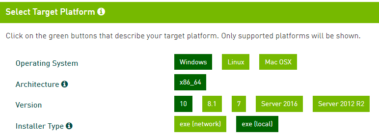
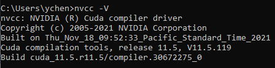
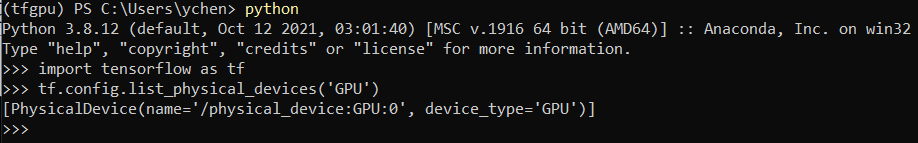
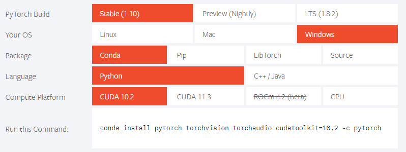
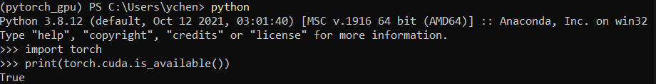
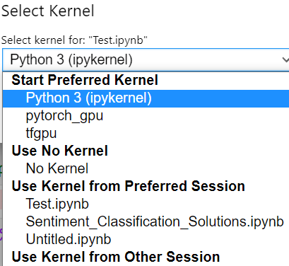
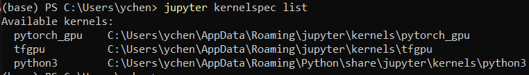

Summary: Records about enabling GPU acceleration on Windows 10 with Jupyter Notebook.

**Contents:**
- [1. Introduction and basics](#1-introduction-and-basics)
- [2. Installing Jupyter lab and setting default directory](#2-installing-jupyter-lab-and-setting-default-directory)
- [3. Installing Cuda and Cudnn](#3-installing-cuda-and-cudnn)
  - [3.1 Installing Cuda](#31-installing-cuda)
  - [3.2 Installing Cudnn](#32-installing-cudnn)
  - [3.3 Adding directory to environment path](#33-adding-directory-to-environment-path)
  - [3.4 Check if it's installed successfully](#34-check-if-its-installed-successfully)
- [4. Creating tensorflow-gpu virtual environment and testing](#4-creating-tensorflow-gpu-virtual-environment-and-testing)
- [5. Creating pytorch-gpu virtual environment and testing](#5-creating-pytorch-gpu-virtual-environment-and-testing)
- [6. Adding virtual env to notebook](#6-adding-virtual-env-to-notebook)
- [7. NVDashboard](#7-nvdashboard)
- [Reference:](#reference)

## 1. Introduction and basics

Both Tensorflow and PyTorch provide GPU acceleration option, the Google Colab and Kaggle Notebook also provide GPU/TPU acceleration options.

This blog is about my recent configure about GPU acceleration on Windows 10 desktop.

Suppose Anaconda has been intalled. 

The common commands about creating virtual environment is following:

```bash
#the below commands run in anaconda prompt

# list virtual environment
conda env list

# create new virtual env, 
conda create -n env_names package_names   # conda create -n tfgpu python=3.8

# activate virtual env
conda activate tfgpu

# deactivate current environment
conda deactivate

# delete virtual env
conda env remove -n env_name
```

Hardware: 
- Nvidia GeForce RTX 2060 super
- Windows 10


## 2. Installing Jupyter lab and setting default directory

- Installing Jupyter lab.

  `pip install jupyterlab`

- Generating config file `jupyter_notebook_config.py`:
  
  `jupyter notebook --generate-config`

  on Window, the file will be in:

  `C:\Users\username\.jupyter/jupyter_notebook_config.py`

  on Ubuntu, the file will be in:

  `~/.jupyter/jupyter_notebook_config.py`

- Setting default start directory

  on Windows:

  ```
  c.NotebookApp.notebook_dir = u'D:\\OneDriveFolder\\Notebook_OneDrive'
  ```

  on Ubuntu:

  ```
  c.NotebookApp.notebook_dir = '/home/ycheng/Documents/Notebook'
  ```

## 3. Installing Cuda and Cudnn

### 3.1 Installing Cuda

Download [Cuda](https://developer.nvidia.com/cuda-downloads).

<p align="center">

</p>

Version: `cuda_11.5.1_496.13_windows`.

Install it with default settings.

### 3.2 Installing Cudnn

Login or Create account and download [Cudnn](https://link.zhihu.com/?target=https%3A//developer.nvidia.com/rdp/cudnn-download)

Version: `cudnn-windows-x86_64-8.3.1.22_cuda11.5-archive`.

Unzip the file and place the file to `C:\Program Files\NVIDIA GPU Computing Toolkit\CUDA\v11.5`.

### 3.3 Adding directory to environment path

When installing Cuda, some directory will be added to path automatically, some are not. 
```
C:\Program Files\NVIDIA GPU Computing Toolkit\CUDA\v11.5
C:\Program Files\NVIDIA GPU Computing Toolkit\CUDA\v11.5\libnvvp
C:\Program Files\NVIDIA Corporation\Nsight Compute 2021.3.1\
C:\Program Files\NVIDIA GPU Computing Toolkit\CUDA\v11.5\extras\CUPTI\lib64
C:\Program Files\NVIDIA GPU Computing Toolkit\CUDA\v11.5\cudnn-windows-x86_64-8.3.1.22_cuda11.5-archive\bin
```

### 3.4 Check if it's installed successfully

Open command window and type: `nvcc --V`

<p align="center">

</p>

The above figure means Cuda and Cudnn have been installed successfully.

## 4. Creating tensorflow-gpu virtual environment and testing

- Creating virtual env:

  `conda create -n tfgpu python=3.8`

- Activate tfgpu
  
  `conda activate tfgpu`

- Installing `tensorflow-gpu`

  `pip install tensorflow-gpu`

- Activating python and testing

  ```python
  import tensorflow as tf
  tf.config.list_physical_devices('GPU')
  ```

  <p align="center">
  
  </p>

## 5. Creating pytorch-gpu virtual environment and testing

- Creating virtual env:

  `conda create -n pytorch_gpu python=3.8`

- Activate tfgpu
  
  `conda activate pytorch_gpu`

- Installing `pytorch, torchvision, torchaudio, cudatoolkit`

  `conda install pytorch torchvision torchaudio cudatoolkit=10.2 -c pytorch`

  <p align="center">
  
  </p>

  Note that the cuda version 10.2 was selected, because cuda 11.5 is not available, which could be a problem.

- Activating python and testing

  ```python
  import tensorflow as tf
  tf.config.list_physical_devices('GPU')
  ```

  <p align="center">
  
  </p>

## 6. Adding virtual env to notebook

- Activate tfgpu

  `conda activate tfgpu`

- Installing `ipykernel`

  `pip install --user ipykernel`

- Adding virtual env to notebook
  
  ```bash
  python -m ipykernel install --user --name=tfgpu
  python -m ipykernel install --user --name=pytorch_gpu
  ```

  Now the new virtual env will be available in notebook

  <p align="center">
  
  </p>

- List the virtual env in notebook
  
  `jupyter kernelspec list`

  Note: since jupyter hasn't been installed in new virtual env, I run above command under `base` environment. 

  <p align="center">
  
  </p>

- Removing virutal env from notebook
  
  `jupyter kernelspec uninstall env_name`

## 7. NVDashboard

<https://developer.nvidia.com/blog/gpu-dashboards-in-jupyter-lab/>


## Reference:
1. <https://zhuanlan.zhihu.com/p/420694711>
2. <https://www.jianshu.com/p/ed57d1dbf3f9>